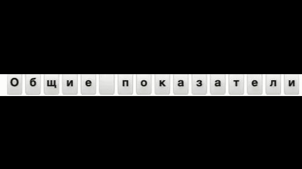

# flip-board

markdown
# flip-board

A high-quality, canvas-based flip-board component for Angular. Create stunning animated word displays with smooth flip transitions and customizable themes.

[](https://www.npmjs.com/package/@angular-monorepo/flip-board)

## 🎬 Preview



## ✨ Features

[](https://www.npmjs.com/package/@angular-monorepo/flip-board)

## ✨ Features

- **Smooth Flip Animation**: Professional-grade flip animation with physics-based easing
- **Canvas-Based Rendering**: High-performance rendering with smooth 60fps animations
- **Customizable Themes**: Light and dark themes built-in
- **Resizable**: Fully responsive and adapts to container size
- **Configurable Words**: Display custom words or use default airport-style rotating words
- **Loop Mode**: Optional automatic cycling through word list
- **Click Interaction**: Click to manually change words in loop mode
- **Angular Standalone**: Modern standalone component with no external dependencies

## 📦 Installation

Install the package via npm:

```bash
npm install flip-board
```

Or using yarn:

```bash
yarn add flip-board
```

Or using pnpm:

```bash
pnpm add flip-board
```

## 🚀 Usage

### Basic Usage

Import the component and add it to your component's imports:

```typescript
import { FlapBoardComponent } from 'flip-board';

@Component({
  selector: 'app-root',
  standalone: true,
  imports: [FlapBoardComponent],
  template: `
    <flip-board></flip-board>
  `
})
export class AppComponent {}
```

### With Custom Words

Display your custom words:

```typescript
<flip-board [words]="['HELLO', 'WORLD', 'FLIP-BOARD']"></flip-board>
```

### With Themed Display

Use the built-in light or dark theme:

```html
<!-- Dark theme (default) -->
<flip-board theme="dark" [words]="['DARK', 'MODE']"></flip-board>

<!-- Light theme -->
<flip-board theme="light" [words]="['LIGHT', 'MODE']"></flip-board>
```

### With Automatic Looping

Enable auto-cycling through words:

```html
<flip-board theme="dark" [words]="words" [loop]="true"></flip-board>
```

### With Click Interaction

When loop mode is enabled, you can click to change the word:

```html
<flip-board [loop]="true" (click)="onClick()"></flip-board>
```

### With Custom Sizing

Control the maximum width of the flip board:

```html
<!-- Small (max 480px) -->
<flip-board size="sm" [words]="['SMALL', 'SIZE']"></flip-board>

<!-- Medium (max 720px) -->
<flip-board size="md" [words]="['MEDIUM', 'SIZE']"></flip-board>

<!-- Large (max 960px) -->
<flip-board size="lg" [words]="['LARGE', 'SIZE']"></flip-board>
```

## 🎨 Configuration

### Inputs

| Input | Type | Default | Description |
|-------|------|---------|-------------|
| `theme` | `FlapBoardTheme` | `'dark'` | Theme variant - `'dark'` or `'light'` |
| `size` | `FlapBoardSize` | `'sm'` | Size variant - `'sm'`, `'md'`, or `'lg'` |
| `words` | `string[]` | `DEFAULT_WORDS` | Array of words to cycle through |
| `loop` | `boolean` | `false` | Enable automatic cycling through words |

### Input Types

```typescript
export type FlapBoardTheme = 'dark' | 'light';
export type FlapBoardSize = 'sm' | 'md' | 'lg';
```

## 📝 Available Words

By default, the component displays a rotating list of popular travel destinations:
- TOKYO, LONDON, NEW YORK, PARIS, BERLIN, AMSTERDAM, DUBAI, SINGAPORE, SYDNEY, ROME, HONG KONG, ISTANBUL

You can customize this by providing your own `words` array.

## 🎯 Animation Details

- **Flip Duration**: 400-800ms (randomized for natural feel)
- **Word Change Interval**: 2200ms when looping
- **Blank Hold Duration**: 400ms between word changes
- **Stagger Delay**: Random 0-150ms between letter flips

## 🎨 Theme Colors

### Dark Theme Palette
- Flap Background: `#161616`
- Text: `#e9e6dc`
- Divider: `#050505`
- Hinge: `#3a3a3a`
- Shadow: `rgba(0,0,0,0.6)`

### Light Theme Palette
- Flap Background: `#e4e4e1`
- Text: `#161616`
- Divider: `#b8b8b3`
- Hinge: `#a5a5a0`
- Shadow: `rgba(0,0,0,0.2)`

## 📱 Responsive Behavior

The component automatically:
- Detects container size changes
- Adjusts cell dimensions to fit available space
- Maintains aspect ratio across all sizes
- Adapts to high-DPI displays for crisp rendering

## 🔧 Size Configuration

| Size | Max Width |
|------|-----------|
| `sm` | 480px |
| `md` | 720px |
| `lg` | 960px |


## 📦 Package Information

- **Name**: `@angular-monorepo/flip-board`
- **Version**: `0.0.1`
- **Peer Dependencies**:
  - `@angular/core` ^21.2.0
- **Side Effects**: `false` (tree-shakeable)

## 🆚 Browser Support

Since this component uses:
- Canvas API (widely supported)
- `requestAnimationFrame` (all modern browsers)
- ES6+ JavaScript
- CSS transforms and box-shadow (all modern browsers)

It supports all modern browsers that support Angular 21 and above.

## 📄 License

[MIT License](LICENSE)

## 🤝 Contributing

Contributions are welcome! Please feel free to submit a Pull Request.

## 📞 Support

For issues and feature requests, please create an issue in the repository.

